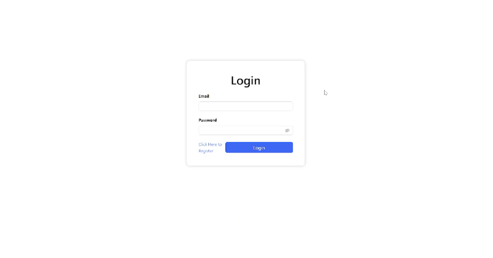
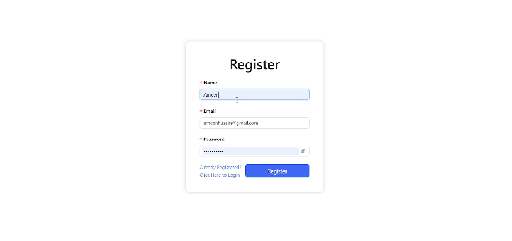
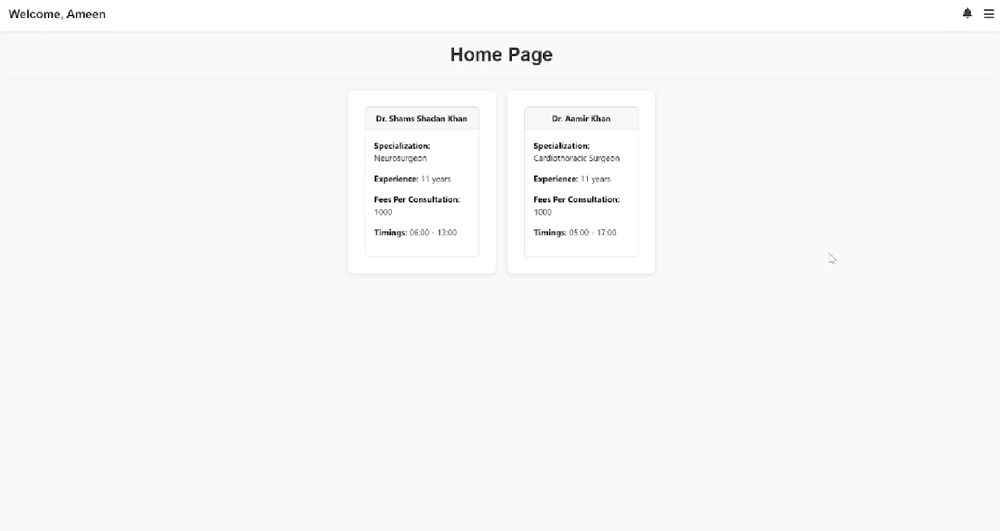
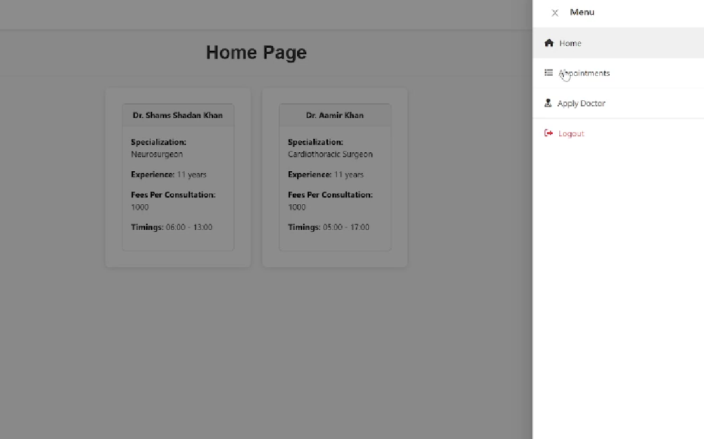
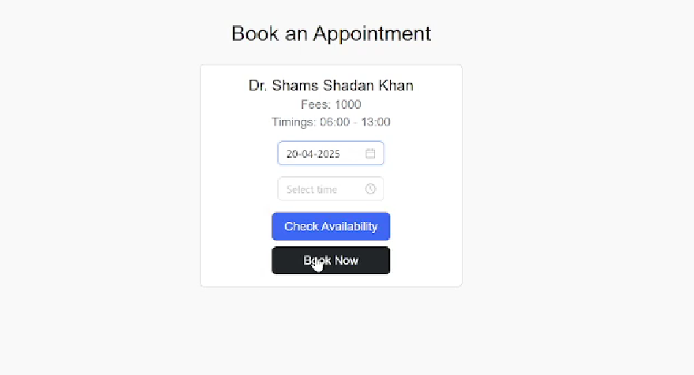
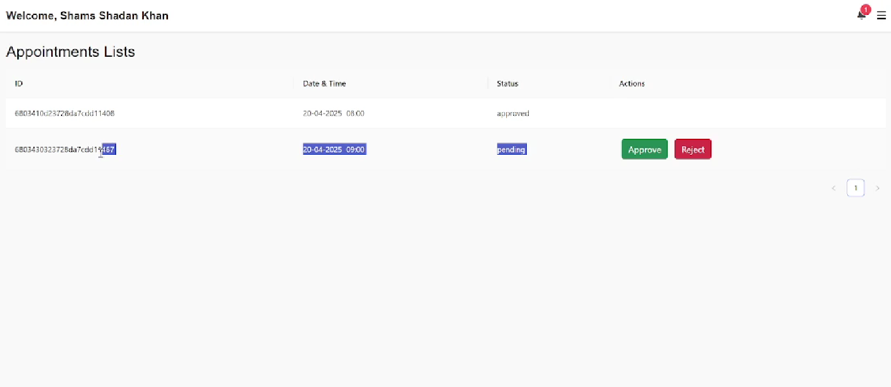
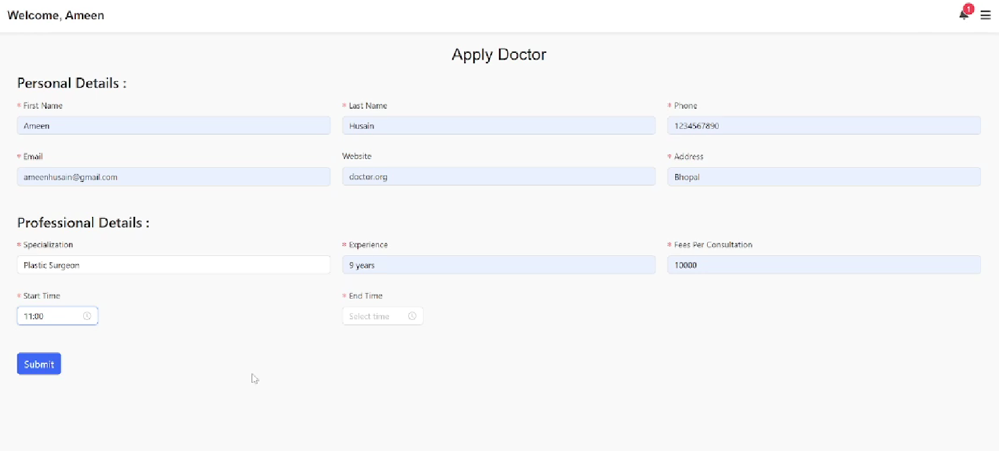

# MediBoard

MediBoard is a full-stack web application developed using the MERN stack. It serves as a digital platform to help patients book appointments with certified doctors, while also offering dashboards for doctors and administrators to manage their workflows efficiently. The system focuses on accessibility, security, and a user-friendly interface for all stakeholders.

---

## Features

- Secure role-based login for patients, doctors, and administrators
- Appointment booking with real-time doctor availability
- Search and filter doctors by department, location, or availability
- Medical profile management for patients
- Doctor dashboard with schedule management tools
- Admin panel for user and platform oversight

---

## Project Overview

- **Project Name**: MediBoard  
- **Technology Stack**: MERN (MongoDB, Express.js, React.js, Node.js)  
- **Mentorship**: SmartBridge Full Stack Development Program  
- **Team Roles**:
  - Ameen – Backend Development
  - Shams – Frontend Development
  - Aamir – Full Stack Integration and Testing

---

## Screenshots

Interface screenshots are available in the `Images/` directory:

| Login Page | Register Page |
|------------|----------------|
|  |  |

| Home Page | Navigation Menu |
|------------|------------------|
|  |  |

| Doctor Appointment Booking | Appointment List Screen |
|----------------------------|-------------------|
|  |  |

| Applying Doctor Screen |
|------------------|
|  |

---

## Team Members

| Name                | Roll No       | Role                             |
|---------------------|---------------|----------------------------------|
| Shams Shadan Khan   | 22BCG10128    | Frontend Developer               |
| Mohd Ameen Husain   | 22BSA10209    | Backend Developer                |
| Aamir Khan          | 22BCG10148    | Full Stack Support and Testing   |

---


## Installation and Setup

To run MediBoard locally:

### 1. Clone the Repository
```bash
git clone https://github.com/ShamsShadanKhan/MediBoard.git
cd MediBoard
npm install
npm start
cd client
npm install
npm start

